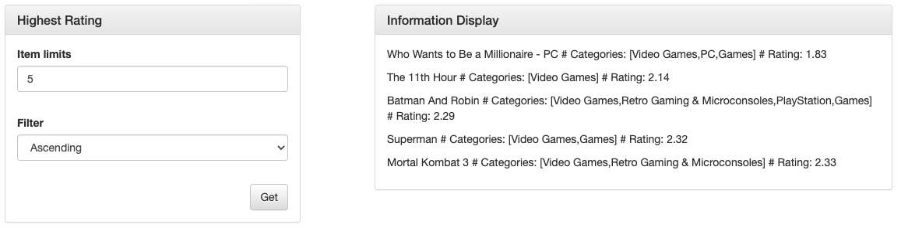

# Amazon Review Dataset Visualization

## Introduction
This is a project for visualization of Amazon Review Dataset, there are many categories(Appliances, Books, Grocery and Gourmet Food) contained in this dataset.
In this project, you can get all items that you are interested in such as which item people most likely also buy,
which item people most likely also view. Besides we implement a Graph Neural Network to analysis this dataset, you can provide
a product name, then we give you a prediction category.

Dataset: [Amazon review data](https://cseweb.ucsd.edu/~jmcauley/datasets/amazon_v2/)

Project for SI507 - WN23 

Professor: Bobby Madamanchi

## Quick Start
Create a new virtual environment and install dependencies.
```bash
conda create -n graph
pip install -r req.txt
pip install -r req-pyg.txt
```
To start the program.
```bash
python app.py
```
Our app will be hosted on `http://localhost:5000`.

## Data Sources
- Number of Users: 5523
- Number of Items: 17389
- Number of Interactions: 496315
- Number of Brands: 330
- Number of Categories: 149

## Features
1. Retrieve items that people buy most, you can set a limit and filter the result by ascending or descending.


2. Retrieve items that people view most, you can set a limit and filter the result by ascending or descending.


3. Retrieve items that have highest rating or lowest rating, you can set a limit and filter the result by ascending or descending.


4. Using Graph Attention Network as backbone, make an inference for product category by giving its name.


5. Graph Dataset Visualization


## Details
### For front-end
- Bootstrap
- jQuery
- Ajax

### For back-end
- Flask
- Networkx

|API URL|Method|Description|
|---|---|---|
|/|GET|return homepage|
|/most|POST|get most buy/view items|
|/rating|POST|get highest rating items|
|/infer|POST|predict category by given product name|
|/graph|GET|redirect to graph visualization|

Using json format for data serialization

## Supplement
To use GNN inference, we need to apply for an OpenAI API key to get product embedding.
API key should be stored in `key` file.

`POST https://api.openai.com/v1/embeddings`